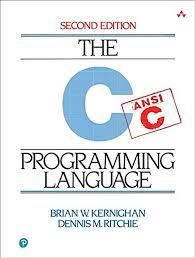

# Hello!

I am a young amateur C programmer. I love C because C is the best language. Python, Rust, OCaml, JavaScript, Java, C++, C#, Perl, and Flash are all extremely bad programming languages. OOP is the worst thing invented in the history of humanity. I only _ever_ use JavaScript because the internet unfortunately does not support C.

Programming in C is the best thing ever. As long as your code does not segfault, **C is the best programming language**.

C is beautiful in its simplicity and power. It only has 32 keywords _ahem_ C++ has 63 _ahem_, making it incredibly easy to learn. It is perfect in all manners. My only regret about the C programming language is that not everyone uses it. I have to live in deep remorse knowing that some people are not able to enjoy the beauty that is the C Programming Language.

Thank you for taking the time to read this. I just hope that I convinced you to use the C Programming Language. If you are flustered on where to start, here is a great video resource that I used to start learning C (note that this video does not go over memory management very well, and you will have to find additional resources): [BroCode](https://www.youtube.com/watch?v=87SH2Cn0s9A&ab_channel=BroCode).
